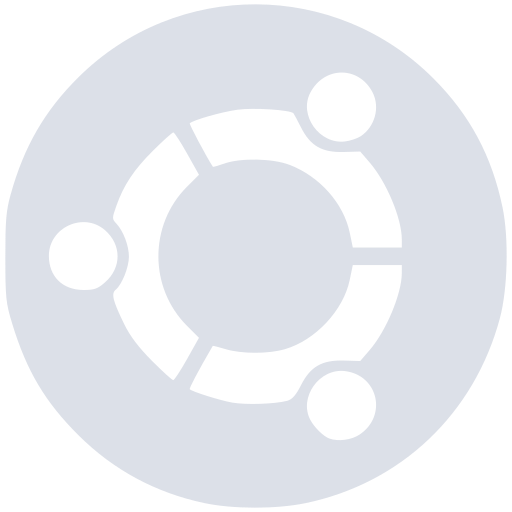

# Catppuccin SDDM Theme
A sddm theme based on the .

# Previews
<details>
<summary>🌻 Latte</summary>

</details>
<details>
<summary>🪴 Frappé</summary>

</details>
<details>
<summary>🌺 Macchiato</summary>

</details>
<details>
<summary>🌿 Mocha</summary>

</details>

# Installation
don't forget to replace ```<palette>``` with the desired theme palette
```
git clone https://github.com/LucasCalcada/catppuccin-sddm-theme
cd catppuccin-sddm-theme
cp catppuccin-<palette> /usr/share/sddm/themes
```

after that edit the config file at```/etc/sddm.conf``` with the desired palette

sddm.conf:
```
[Theme]
Current=catppuccin-<palette>
```
# Options
The theme has different distro logos to choose from

The logo can be changed by editing the ```theme.conf``` file

theme.conf
```
[General]
distroLogo="./distroLogos/<logo path>.svg"
...
```
the theme colors can be changed on the same file

### Available logos
| Distro | Latte | Frappé | Macchiato | Mocha |
|--------|-------|--------|-----------|-------|
| Arch | |  |  | |
| Debian | |  |  | |
| Fedora | |  |  | |
| Gentoo | |  |  | |
| Manjaro | |  |  | |
| Ubuntu | |  |  | |
